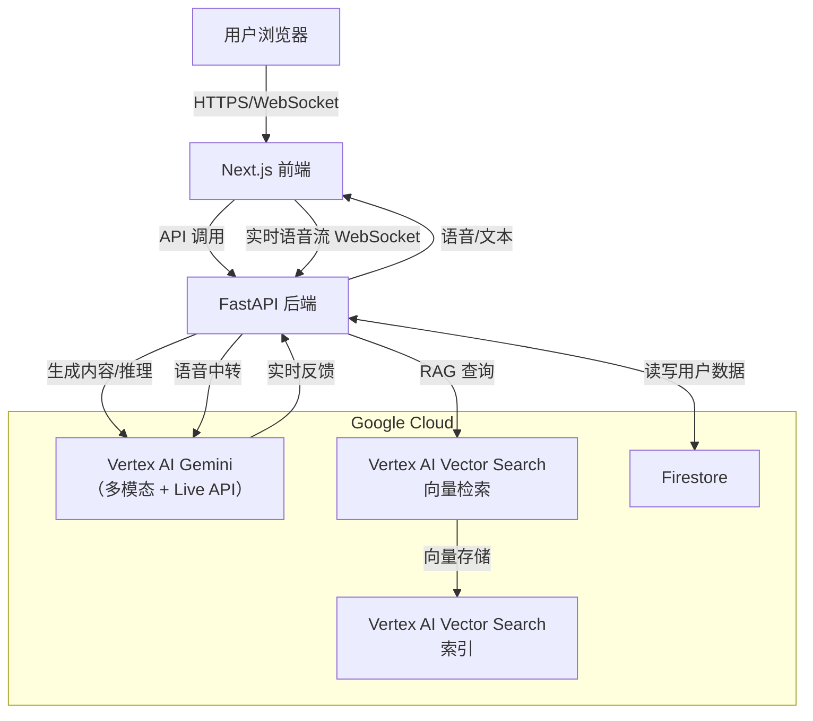

# 02 - 系统架构文档（Architecture）

**项目名称**：Koala - 你的下一代 AI 学习助手  
**版本**：v0.6（ADK 框架 + Creative Storyteller 类别）  
**编写日期**：2026年3月  
**作者**：Johnson  
**目标**：清晰定义基于 ADK 的前后端分离架构，明确参加 **Creative Storyteller** 类别，突出 Gemini interleaved/mixed output 能力，满足 Gemini Live Agent Challenge 要求。

## 1. 整体架构概述

Koala 基于 **Google ADK (Agent Development Kit)** 构建，采用前后端分离的现代 Web 应用架构。

- **比赛类别**：**Creative Storyteller**（多模态故事创作）
- **核心框架**：ADK for Python，构建实时双向流 Agent
- **前端**：Next.js（React 框架），负责用户界面、交互、卡通考拉风格呈现、语音录制
- **后端**：FastAPI + ADK，负责 Agent 编排、WebSocket 管理、RAG 知识库、数据存储
- **AI 核心**：Vertex AI Gemini（多模态 interleaved output），支持文本+图像+音频混合生成
- **存储**：Firestore（用户数据）+ Vertex AI Vector Search（向量检索）
- **认证**：游客模式，使用 Firebase Anonymous Auth
- **部署**：Google Cloud（Cloud Run 前后端 + Vertex AI Endpoint + Firestore）

### 架构图（Mermaid）



- **关键数据流**：
  1. 用户语音/文本输入 → Next.js 采集 → FastAPI
  2. FastAPI → Vertex AI Gemini（生成关卡内容 + 实时反馈）
  3. RAG 查询：上传知识源 → Vertex AI Embedding API 生成向量 → Vertex AI Vector Search 存储 + 检索 → top-k chunk → 严格引用 → 注入 prompt
     - **向量存储**：使用 Vertex AI Vector Search（Google Cloud 原生向量检索）
     - **用户数据**：Firestore 存储（进度、XP、反馈）
  4. 进度/XP/反馈 → Firestore 持久化
  5. 游客认证：Firebase Anonymous Auth → 匿名用户 ID → 关联 Firestore 数据

## 2. 前端架构（Next.js）

- **技术栈**：Next.js 14+（App Router）、Tailwind CSS（卡通考拉风格）、React Hook Form（表单）、Web Audio API / MediaRecorder（语音录制）
- **主要页面**：
  - `/`：Home 主看板（进度卡片、推荐课程、XP 显示）
  - `/courses`：课程列表（卡片式，参考 Brilliant 风格）
  - `/courses/[id]`：课程详情（大纲预览、开始学习按钮）
  - `/lessons/[id]`：关卡页（多模态 step 展示 + 交互题 + 语音输入区）
  - 加载页：显示 Agent 思考动画（考拉抱着树枝转圈）
- **语音处理**：浏览器麦克风授权 → MediaRecorder 录制 → WebSocket (`/api/voice/stream`) 实时流式传输到后端

## 3. 后端架构（Python FastAPI）

- **技术栈**：FastAPI（异步 API）、google-cloud-aiplatform（Vertex AI SDK）、LangChain（RAG 链）、Firestore / SQLite 客户端
- **核心模块**：
  - `/`（根）：健康检查
  - `/courses`：创建课程、上传知识源、生成大纲
  - `/lessons`：生成关卡 step、处理用户反馈、实时语音流
  - `/rag`：知识库构建 + 查询（Embedding + Vector Search + 严格引用）
  - `/auth`：Firebase Anonymous Auth（游客认证）
- **实时语音**：WebSocket 端点 `/api/voice/stream` 接收音频流（WebM/Opus 格式）→ Vertex AI Live API 处理 → 流式返回文本/反馈
  - 语音流转：**前端 (MediaRecorder)** → **FastAPI WebSocket** → **Vertex AI Live API** → **FastAPI WebSocket** → **前端显示/播放**
  - 所有语音数据经过后端中转，便于统一认证、日志记录和异常处理
- **存储层**：统一使用 Firestore（无需双模式切换）
  - 所有数据（用户进度、XP、反馈、向量）存 Firestore
  - 本地开发也需配置 GCP 凭证（即使不部署到云端）
  - 优点：向量持久化（重启不丢失）、实时同步、比赛体验好

## 4. Vertex AI Gemini 集成要点

- **模型选择**：Gemini 1.5 Flash（速度优先，多模态支持）或 Pro（深度推理）
- **主要调用场景**：
  - 生成大纲/关卡内容：`generate_content()` + system prompt（强调引用来源）
  - RAG：结合 Vertex AI Text Embedding API 生成向量
  - 实时语音反馈：Gemini Live API（支持中断、情感分析）
- **提示工程**：每个调用注入用户需求、历史反馈、知识库检索结果，确保答案深度且可引用
- **配额管理**：比赛用免费额度，设置安全阈值

## 5. 统一存储设计（Firestore + Vertex AI Vector Search）

- **用户数据存储（Firestore）**：
  - collections：users（匿名用户）、courses、progress、feedback、xp_logs
  - 实时同步：进度、XP、反馈即时更新
- **向量存储与检索（Vertex AI Vector Search）**：
  - 存储文档向量 + 元数据（来源、页码、原文片段）
  - 高效相似度检索（余弦相似度）
  - 支持高维向量索引
- **游客认证**：Firebase Anonymous Auth → 生成匿名用户 ID → 关联 Firestore 数据
- **GCP 凭证配置**：本地开发和云端部署都需要配置 `GOOGLE_APPLICATION_CREDENTIALS`
  ```env
  # .env.local 和 .env.production 通用
  VERTEX_AI_PROJECT_ID=你的项目ID
  VERTEX_AI_LOCATION=us-central1
  GOOGLE_APPLICATION_CREDENTIALS=路径到service-account.json
  ```

## 6. 部署与扩展性

- **本地部署**：运行 `uvicorn` + `npm run dev`，需配置 GCP 凭证（使用 Firestore）
- **云端部署**：Google Cloud Run（前后端容器化）+ Vertex AI Endpoint + Firestore
- **可扩展点**：未来加游戏化（等级、徽章）、支持更多多模态（视频输入）
